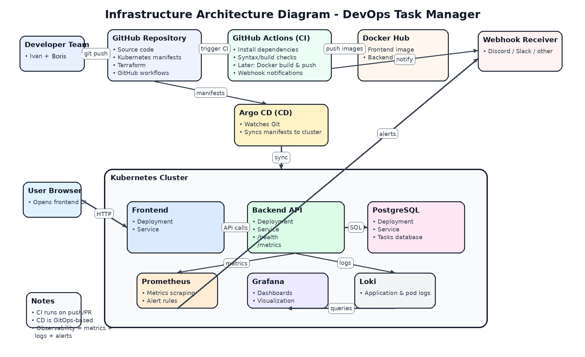

# DevOps Task Manager

DevOps Task Manager is a web-based task management application created to demonstrate a full DevOps lifecycle, including source control, pre-commit validation, CI/CD, containerization, Kubernetes deployment, Infrastructure as Code, observability, alerting, and configuration/secrets management.



## Problem it solves

The project helps users manage daily tasks through a simple web interface.  
Users can create, view, update, complete, and delete tasks.  
The main goal of the project is not only the application itself, but also the complete DevOps pipeline around it.

## Architecture Overview

The system consists of the following main components:

- **Frontend** - React application
- **Backend** - Node.js + Express REST API
- **Database** - PostgreSQL
- **CI** - GitHub Actions
- **Container Registry** - Docker Hub
- **CD** - Argo CD
- **Orchestration** - Kubernetes
- **Infrastructure as Code** - Terraform
- **Observability** - Prometheus, Loki, Grafana
- **Alerting** - Alertmanager with webhook notifications

## Features

- Create tasks
- View all tasks
- Mark tasks as completed
- Delete tasks
- Health endpoint for backend
- Metrics endpoint for Prometheus scraping

## Technologies and Versions

- **Node.js** 22
- **React** 19
- **Vite** 8
- **Express** 5
- **PostgreSQL** 16
- **Docker**
- **Docker Compose**
- **Kubernetes**
- **GitHub Actions**
- **Docker Hub**
- **Argo CD**
- **Terraform**
- **Prometheus**
- **Loki**
- **Grafana**
- **Alertmanager**

## Project Structure

```text
devops-task-manager/
├── app/
│   ├── backend/
│   │   ├── src/
│   │   ├── Dockerfile
│   │   ├── package.json
│   │   └── .env.example
│   └── frontend/
│       ├── src/
│       ├── Dockerfile
│       ├── package.json
│       └── .env.example
├── docs/
│   └── infrastructure-diagram.png
├── k8s/
│   ├── base/
│   └── overlays/
├── terraform/
├── monitoring/
├── .github/
│   └── workflows/
├── .pre-commit-config.yaml
├── docker-compose.yml
├── .gitignore
└── README.md